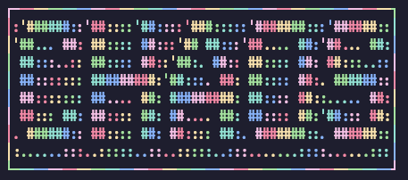
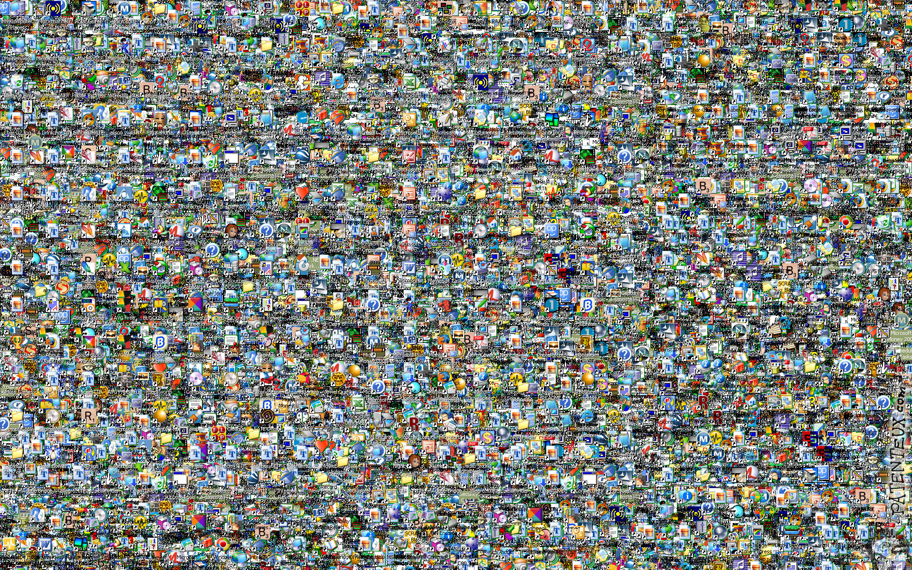
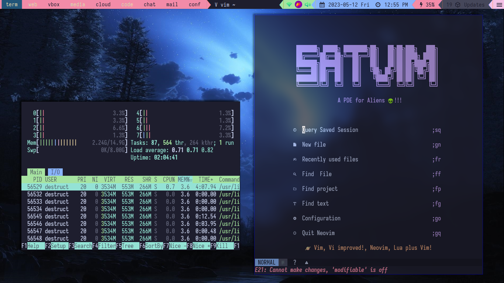

<h1 align="center">
  <br />
  <br />
  
  <br />
  <br />
</h1>

<p align="center"><b>An Operating System For The ChaOS Makers</b></p>

<p align="center">
    <b align="center"><a href="./README.md">Readme</a></b> |
    <b><a href="https://discord.gg/2dnwQcuVCp">Discord</a></b> |
    <b><a href="https://github.com/chaos-os/chaos">GitHub</a></b></b>
</p>

<p align="center">
    <a href="https://github.com/chaos-os/chaos/pulse">
        
    </a>
    <a href="#">
        
    </a>
    <a href="https://github.com/chaos-os/chaos/issues">
        
    </a>
    <a href="https://github.com/chaos-os/chaos/pulls">
        
    </a>
    <a href="./LICENSE">
        
    </a>
    <a href="https://github.com/chaos-os/chaos/releases">
        
    </a>
</p>

**ChaOS** is the name that we have chosen for our pre-installation script which will deploy our configuration files and helper scripts to create a proper full-fleged desktop experience it is basically our desktop environment on your machine.

<p>
    <br/>
    <b> Don't worry 🙂, We will not provide you with this 👇: </b>
    <br/>
    <br/>
    
    <br/>
    <br/>
    <b> Instead we provide you with this 👇: </b>
    <br/>
    <br/>
    
    <br/>
</p>

> **Note**
> Right now we just provide a pre-installation script but with more contribution we will move to provide a complete installation-script like `archinstall` and with even more contributions we would create our own iso with calamares installer.

> **Warning**
> - ChaOS is only for **x86-64 architecture** and will mot work on arm or any other architectures.
> - The installation-script should only be run after the base install of **arch linux** in user mode in the tty.

<details>
  <summary><b>Table of Contents</b></summary>
  <p>

- **Getting Started**
    - [📦 What Do We Provide Out of The Box](#what-do-we-provide-out-of-the-box-)
    - [✔️( Prerequisites](#prerequisites-)
    - [🛠️ Installation](#installation-)
    - [🚀 Updating ChaOS](#updating-chaos-)
    - [⚙️P Post Installation Setup](#post-installation-setup-)
    - [🪲 Common Issues](#common-issues-)
- **Community**
    - [🗨️ FAQ (Frequently Asked Questions)](#faq-frequently-asked-questions-)
    - [📣 More Contributers Wanted](#more-contributers-wanted-)
    - [💖 Supporting Websurfx](#supporting-websurfx-)
    - [📘 Documentation](#documentation-)
    - [🛣️ Roadmap](#roadmap-)
    - [🙋 Contributing](#contributing-)
    - [📜 License](#license-)
    - [🤝 Credits](#credits-)

  </p>
</details>

# What Do We Provide Out of The Box 📦

- [Several helper scripts](https://github.com/chaos-os/chaos-scripts)
- 9 colorschemes to choose from by default
    - Nord
    - Dracula
    - Catppuccin-mocha
    - Gruvbox-dark
    - Solarized-dark
    - Solarized-light
    - Tomorrow-night
    - monokai
    - oceanic-next
- [neon-podcaster](https://github.com/neon-mmd/neon-podcaster) - podcast client
- [stdm](https://github.com/neon-mmd/stdm) - manpage searching application
- [neon-logout](https://github.com/neon-mmd/neon-logout) - logout menu application
- [tplay](https://github.com/maxcurzi/tplay) - An ascii video player _developed by Max Curzi_.
- All the applications I use on daily basis.

**[⬆️ Back to Top](#----------)**

# Prerequisites ✔️

Before you start, make sure you have installed the following prerequisites on your machine:

1.  Git

``` shell
sudo pacman -Sy git
```

2.  Grub

``` shell
sudo pacman -Sy grub
```

**[⬆️ Back to Top](#----------)**

# Installation 🛠️

To install ChaOS run the following commands:

``` shell
git clone https://github.com/chaos-os/chaos.git
cd chaos
./chaos
```

**[⬆️ Back to Top](#----------)**

# Updating ChaOS 🚀

ChaOS can be updated like any other Arch-based linux distros:

``` shell
sudo pacman -Syu
```

or if you prefer abbreviated version:

``` shell
pupd
```

If you want to use the latest config files you can use the following script to update the configs by running the following command:

``` shell
update-configs
```

**[⬆️ Back to Top](#----------)**

# Post Installation Setup ⚙️

## General Setup

- Set the theme using `lxappearance` and `qt5ct`.
- Check the aliases that are avilable for use by running the following command in the terminal:

``` shell
alias
```

## Neovim Setup

- To setup neovim run the following command:

``` shell
nvim +PackerSync
```

> **Note** 
> If you get errors while running the above command it is `normal` and after the installation finished rerun the above command once more an then you will have neovim setup on your system. 

**[⬆️ Back to Top](#----------)**

# Common Issues 🪲

## Why is flatpak/snap/appimage not working?

By default we configure an option in `sysctl` to disable access of namespace cloning by unprivileged user for security reasons but this option used by the container based technologies like flatpaks, appimages and snaps to launch the apps. To allow them to launch apps you will need to disable this option by commenting it in sysctl config which is located under `/etc/sysctl.d/99-sysctl.conf`:

``` conf
# Disable namespace access for unprivileged user
# kernel.unprivileged_userns_clone=0
```

After editing the file and saving it run the following command:

```shell
sudo sysctl --system
```

Now you will be able to launch flatpaks/appimages/snaps as usual.

**[⬆️ Back to Top](#----------)**

# FAQ (Frequently Asked Questions) 💬

## Why ChaOS?

Through the medium of this distro we provide you with both secure, customizable and fast linux distro by tweaking and configuring all available options as best as we can and providing the best experience to the user.

## Can ChaOS be installed on non-systemd Arch-Linux?

Yes, It can be made to run on non-systemd arch linux but it will require tweaking and playing with chaos installer which do not recommend if you are not an experienced linux user because you may change the installer in a way which makes it unusable or gives you a broken or partially installed system.

**[⬆️ Back to Top](#----------)**

# More Contributers Wanted 📣 

We are looking for more willing contributors to help grow this project. For more information on how you can contribute, check out the [project board](https://github.com/neon-mmd/websurfx/projects?query=is%3Aopen) and the [CONTRIBUTING.org](CONTRIBUTING.org) file for guidelines and rules for making contributions.

**[⬆️ Back to Top](#----------)**

# Contributing 🙋 

Contributions are welcome from anyone. It doesn\'t matter who you are; you can still contribute to the project in your way.

## Not a developer but still want to contribute?

Check out this [video](https://youtu.be/FccdqCucVSI) by Mr. Nick on how to contribute.

## Developer

If you are a developer, have a look at the [CONTRIBUTING.org](CONTRIBUTING.org) document for more information.

**[⬆️ Back to Top](#----------)**

# License 📜 

ChaOS is available under the [GPLv3](LICENSE) license.

**[⬆️ Back to Top](#----------)**

# Credits 🤝 

We would like to thank the following people for their contributions and support:

<p>
  <br />
  <a href="https://github.com/chaos-os/chaos/graphs/contributors">
    
  </a>
  <br />
</p>

**[⬆️ Back to Top](#----------)**

---

<p align="center">
  <a href="https://github.com/neon-mmd/websurfx">
    
  </a>
  <br /><br />
  <i>Thank you for Visiting</i>
</p>
